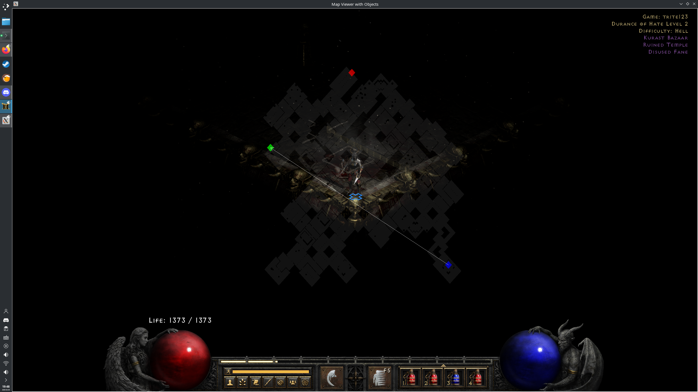

# d2rLinuxMH

requires: https://hub.docker.com/r/blacha/diablo2

nlohmann-json

game must be in windowed mode for the map overlay to work

probably only works for X11 KDE?

'''

bash build_windows.sh

bash build_drawmapseedcpp.sh

bash memgoblin.sh

enjoy

'''

it doesnt read player x,y..... yet?

